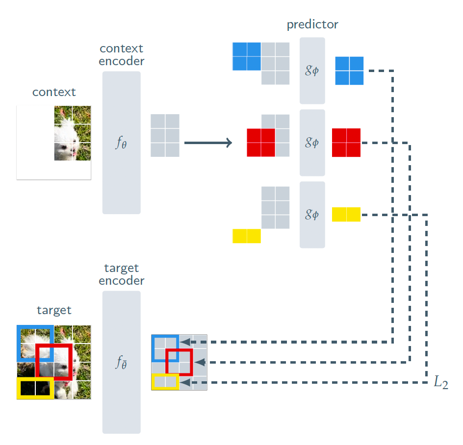
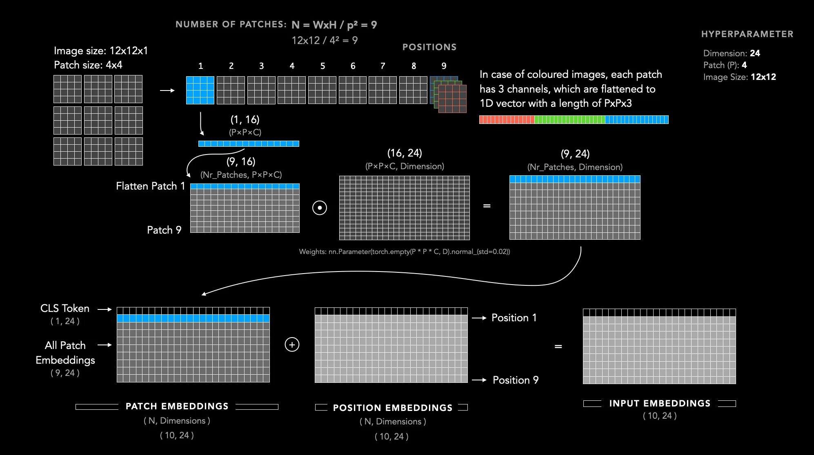

# I-JEPA

I-JEPA implemented from scratch in PyTorch — no `timm`, no reference code — and
evaluated against a matched BYOL baseline.

## What it does

Hide regions of an image; predict **their representations**, not their pixels.
No decoder anywhere in the loss.

That removes the reconstruction tax — a pixel-trained encoder must represent
sensor noise and texture, because MSE has no mechanism to discard anything. But
it also makes collapse the global minimum of the objective: a constant encoder
scores exactly zero.

Most of the architecture exists to prevent that. This repo measures whether each
part is load-bearing.

## Architecture



*Figure from Assran et al. 2023.*

Three networks, all instantiations of the same ViT class:

| | input | tokens | width | depth | gradient | kept |
|---|---|---|---|---|---|---|
| `f_θ` context encoder | context patches only | 19–34 | 192 | 6 | yes | **yes** |
| `f_θ̄` target encoder | all patches | 64 | 192 | 6 | no — EMA | for probing |
| `g_φ` predictor | ctx + mask tokens | \|C\|+\|Bₘ\| | 96 | 2 | yes | discarded |

The target encoder sees the **whole image**; the target rows are indexed out of
its output. Feeding it only the target block would encode an isolated crop
rather than a region in context.

### The query

```
mask_token_j  =  m  +  pos_pred[j]
                 |           |
    one learned  |           +-- which patch to predict
    vector,      |
    identical    +-- carries NO content
    everywhere
```

Position is a query row's entire identity. The only route to an answer is
attention over the context rows — which is what makes this prediction rather
than lookup.

### One training step

```
1  sample masks - ONE draw per batch, shared across all 256 images
2  s_y = f_target(x)                no_grad, all 64 tokens
3  t_m = LN(s_y[B_m]).detach()      per block
4  s_C = f_online(x, C)             ONCE - the expensive pass
5  for m in 1..4:
       s_hat_m = g_phi(s_C, C, B_m) predictor runs 4x, encoders run once
       loss += mean((s_hat_m - t_m)^2)
6  loss /= 4;  backward;  opt.step()
7  theta_bar <- tau*theta_bar + (1-tau)*theta    tau: 0.996 -> 1.0 linear
8  log loss, latent variance, effective rank
```

### Backbone



*Figure from Dosovitskiy et al. 2021.*

The encoder is a ViT, written from scratch on top of a GPT-2 style attention
block with the causal mask removed. Three properties of the objective force a
transformer rather than a CNN:

- **The loss is per-patch.** Twelve predictions at twelve addresses. A ResNet's
  global average pool destroys spatial identity — there is no coordinate to
  index, so the loss cannot be written.
- **The input is a variable-length subset.** Convolution needs a dense grid;
  after the target blocks are removed the surviving context is an irregular
  scatter. A transformer takes a token list — 19 today, 24 tomorrow.
- **The evidence is far from the question.** Contiguous block masking puts
  distance between the hole and the nearest clue by design. Attention reaches
  any patch in layer 1; convolution's locality prior fights the task.

Config: 32×32 input, patch 4 → 8×8 grid → 64 tokens, d=192, depth 6, 3 heads,
2.69M parameters. `n_kv_heads = n_heads` — GQA shrinks a KV cache a bidirectional
encoder does not have. No `[CLS]` token; mean pooling matches BYOL's global
average pool so the probe comparison is like-for-like.

## Relation to BYOL


*Figure from Grill et al. 2020.*

I-JEPA is in the BYOL family — architectural asymmetry as collapse prevention,
no negatives. What carries over and what changed:

| | BYOL | I-JEPA |
|---|---|---|
| the two views | two augmentations of one image | context / target patches of one image |
| backbone | ResNet-18 | ViT |
| projector | MLP | none — loss lives in the representation you keep |
| predictor | MLP | narrow ViT, conditioned on **position** |
| loss target | one global vector per view | one vector **per patch** — 64 per image |
| symmetrised | yes | no — the roles are asymmetric by construction |
| stop-grad | yes | unchanged |
| EMA target | yes | unchanged |

The four differences that matter: masking replaces augmentation, so invariances
are discovered rather than hand-designed; there is no projector; the loss is
per-patch; and the predictor takes a conditioning input saying *where* to
predict. That last slot is the world-model seam.

## Results

Full numbers in [`logs/results.md`](logs/results.md).

| | probe (CIFAR-10 linear) |
|---|---|
| I-JEPA, 100 epochs | 57.6 |
| I-JEPA + RMSNorm/SwiGLU, 40 epochs | 55.8 |
| BYOL (ResNet-18, matched protocol) | 80.07 |

### Collapse ablations — 40 epochs, matched config

| run | loss | var | eff. rank | probe |
|---|---|---|---|---|
| baseline | ~0.35 | 0.95 | ~50 | 51.3 |
| no stop-grad | 0.0000 | 0.0000 | 1.6 | — |
| no EMA | 0.0252 | 0.0220 | 3.7 | 21.0 |
| no target LayerNorm | 0.2425 | 0.9029 | 81.4 | 48.3 |

**Stop-grad is a wall.** Remove it and the encoder becomes a constant function in
under 50 steps, with loss reaching exactly 0.0000 — the value theory predicts for
a constant encoder.

**EMA is not optional at this scale.** SimSiam showed stop-grad plus a predictor
suffices. That mechanism is visible here — the run dives toward collapse by step
200, then *bounces out* at step 600 with variance recovering to 0.985 — but it
does not hold. It settles at rank 3.7 and probes at 21%.

**Effective rank is necessary, not sufficient.** Removing the target LayerNorm
gave *lower loss and higher rank* than baseline, and a worse probe. Every monitor
metric read green on a run that was measurably worse.

### RMSNorm + SwiGLU, parameter-matched

SwiGLU hidden width `8d/3 = 512` gives 296,128 params against the GELU MLP's
295,872 — 0.09% apart, so the gain is not capacity.

**+4.5 probe points at matched parameters and matched steps**, reaching close to
the 100-epoch baseline in 40 epochs.

## Why the gap to BYOL

Not undertraining — the probe-vs-epochs curve (51.3 / 55.9 / 57.6 at 40 / 70 /
100) decelerates clearly. Two identified causes:

**Mask shape degeneracy at 8×8.** Scale 0.15–0.20 of 64 patches gives 9.6–12.8;
intersected with aspect ratio 0.75–1.5 and integer sides, only 3×3, 3×4 and 4×3
are reachable. Only *position* varies. The paper's 14×14 grid admits far more.

**ViT data-hunger.** 50k images at 32×32 is precisely the regime where the ViT
paper found CNNs win. BYOL's ResNet gets locality and translation equivariance
for free.

## Layout

```
models/
  layers.py      Attention, MLP, SwiGLU, ViTBlock, norm/ffn dispatchers
  vit.py         PatchEmbed, VIT
  masking.py     multi-block sampler
  ema.py         target encoder build, update, momentum schedule
  predictor.py   narrow ViT with positional mask tokens
train/
  ijepa.py       pretraining loop
  loss.py        L2 in latent space
  probe.py       frozen linear probe
utils/
  monitor.py     latent variance + effective rank
logs/
  results.md
  figures/
```

## Run

```bash
python -m train.ijepa     # pretrain
python -m train.probe     # evaluate
```

Config flags on `VIT` and `Predictor`: `norm_type` in {`layer_norm`, `rms_norm`},
`ffn_type` in {`gelu_mlp`, `swiglu`}.

## Status

- [x] ViT encoder, multi-block masking, EMA target, predictor, latent loss
- [x] Collapse monitor — latent variance + effective rank
- [x] Linear probe vs BYOL, with a convergence curve
- [x] Three collapse ablations
- [x] RMSNorm + SwiGLU, parameter-matched
- [ ] V-JEPA tube masks
- [ ] DreamerV3 integration

## A note on framing

I-JEPA is a **representation learner** in the BYOL family. It has no actions and
no time axis, so it is not a world model.

The next step is to replace DreamerV3's per-frame CNN with this encoder. The RSSM
continues to own state, dynamics, and actions. The question being tested is
whether a *predictability-shaped* latent is a better substrate for planning than
a *pixel-shaped* one.

Note where the seam is: the predictor is conditioned on `pos_pred[j]`, a query
saying *where* to predict. Replace that with an action embedding and the same
architecture, loss, and anti-collapse machinery become a world model.

## References

- Assran et al. 2023 — *Self-Supervised Learning from Images with a
  Joint-Embedding Predictive Architecture*
- Grill et al. 2020 — *Bootstrap Your Own Latent*
- Chen & He 2021 — *Exploring Simple Siamese Representation Learning*
- Dosovitskiy et al. 2021 — *An Image is Worth 16×16 Words*
- Hafner et al. 2023 — *Mastering Diverse Domains through World Models*
